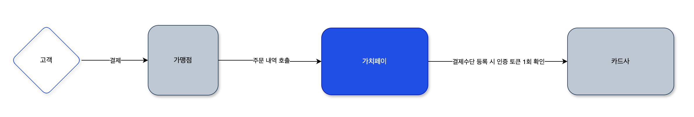
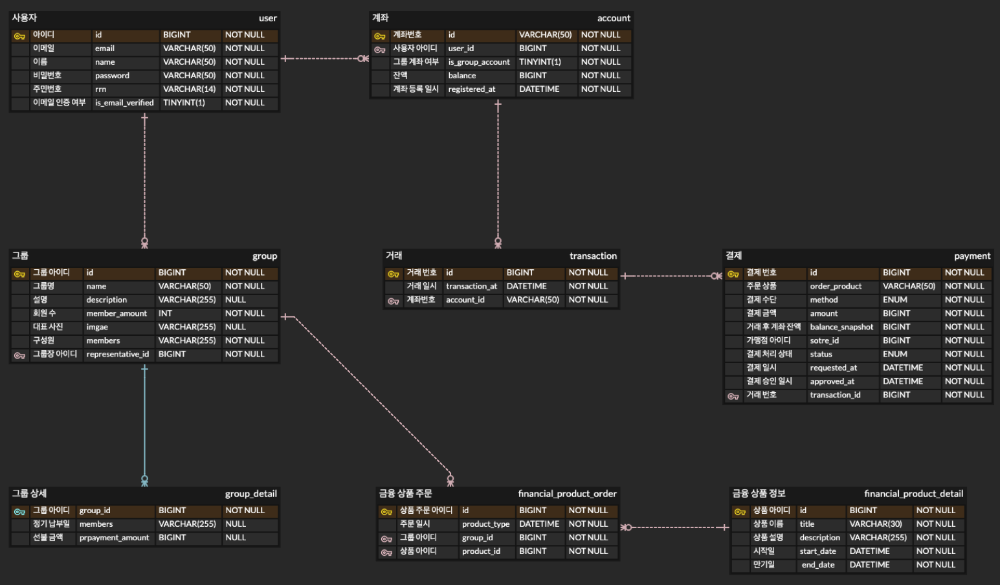

# 가치페이

## 프로젝트 소개
- 친구, 가족, 동호회 등 각종 모임에서 돈을 모아 함께 사용하는 단체 간편결제 시스템입니다.
- 목표 금액 설정 후 도달 시 자동으로 구성원들에게 분배해주는 서비스를 제공합니다.

### 주요 기능

** 타사 혹은 자사의 계좌 혹은 카드가 있다는 가정하에 진행 **<br>
** PG(Payment Gateway)로 등록되었다는 가정하에 진행 **<br>
- [ 회원 ] 
  - 회원 정보 조회
  - 계좌 등록 혹은 카드 등록

인증 과정


- [ 그룹 ]
  - 그룹 생성 및 대표 계좌 등록
  - 그룹 멤버 등록
  - 가치 머니(선불금) 충전
  - 정기 회비 납부
  - 그룹 상세 정보 조회 ( 정기 납부일, 그룹 충전금, 멤버 별 총 납부액, 멤버 별 당월 미납 여부 )
  - 그룹 해지

```markdown
- 대표 계좌는 그룹 생성 멤버의 계좌로 생성
- 목표 금액 설정 가능
- 해당 멤버가 미납 상태라면 그룹 탈퇴 불가
- 멤버 모두가 동의할 시 그룹 해지 가능
```

- [ 거래 ]
  - 거래 내역 조회
  - 그룹의 멤버들에게 거래 시 알림

- [ 거래 - 결제 ]
  - 결제
    - 주문
    - 주문 취소
    - 환불
    - 부분 환불
    
결제 과정
    
```markdown
- Access Token을 사용하여 카드사에 결제를 요청하는 API 호출
```

대사(Reconciliation)    
- 대사 일치
- 대사 불일치

중복 거래 방지(AOP)
- 기타 인프라(Redis)를 활용하여 동시성을 제어

### 보안 
- access token - 주기 짧게하여 보안성 높임(30분)
- refresh token - access token 보다 주기 길게 설정(1일)

```markdown
- 로그인 시 AccessToken & RefreshToken 발급(Redis에 저장)
```

### 부가 기능 
** 주요 기능 구현 후 추가 예정 **
- 가계부
- 현장 결제 시 그룹의 멤버 수에 따른 혜택 적용(최대 5명)
- 모임 활동 추천 ( ex.소비나 자산에 따른 다른 활동 추천 )

### 키 포인트 
- RESTful API 디자인 원칙 따르기
- 본인 인증 및 로그인 (JWT, OAuth2)
- 거래 데이터 보호(SSL/TLS)
- 결제와 송금에 관련된 트랜잭션 처리
- 중복 거래 방지(AOP)
- 결제 데이터 수집

## ERD


[// ]: # ([ 은행 ])

[// ]: # (- [ 금융 상품 ])

[// ]: # (  - 예적금)

[// ]: # (    - 예금)

[// ]: # (    ```markdown)

[// ]: # (    예금 목표 설정 가능)

[// ]: # (    )
[// ]: # (    ```)

[// ]: # (    - 적금)

[// ]: # (    ```markdown)

[// ]: # (    만기 목표 금액 도달 시 알림 및 멤버들에게 금액&#40;이자 포함&#41; 자동 분배.)

[// ]: # (- 금융 상품 추천)
[// ]: # (    ```)