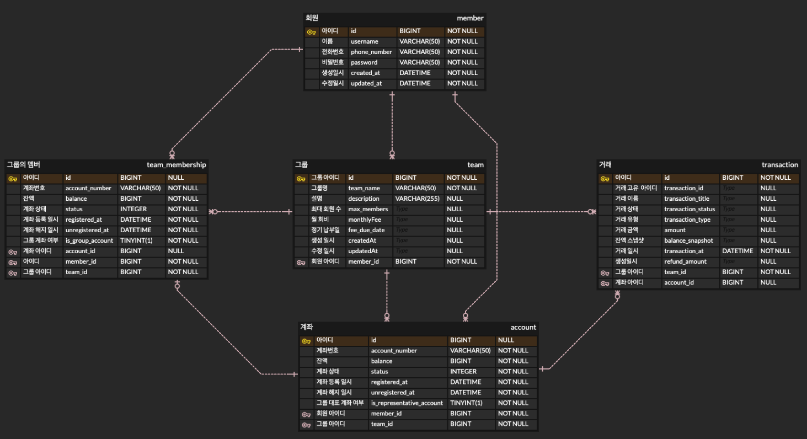

# 가치페이

# 프로젝트 소개
- 친구, 가족, 동호회 등 각종 모임에서 돈을 모아 함께 사용하거나 회비를 관리하는 단체 지갑 서비스입니다.
- 월 회비를 설정 후 매월 정해진 날짜에 자동으로 구성원들의 계좌에서 회비를 걷습니다.

## 개발 환경
- Java 17
- MariaDB 3.0.6
- Spring Boot 3.2.6

## 주요 기능

** 타사 혹은 자사의 계좌가 있다는 가정하에 진행 **<br>
### 회원 관리
- 회원 등록
- 회원 정보 수정
- 회원 탈퇴
```markdown
인증 및 인가
- access token -> 주기 짧게하여 보안성 높임(30분)
- Redis를 통해 access token 상태 관리
```

### 계좌 관리
- 계좌 생성
- 계좌 정보 수정
- 계좌 삭제
- 잔액 조회
- 잔액 충전 및 사용

### 그룹 관리
- 팀 생성
- 팀 정보 수정
- 팀 삭제
- 팀 멤버 관리 (가입, 탈퇴)
```markdown
- 대표 계좌는 그룹 생성 멤버의 계좌로 등록됨
- 월 회비 설정 가능
- 스케쥴링을 통한 월 회비 납부   
- 대표자는 그룹 탈퇴 불가능(그룹 삭제 혹은 대표 위임 후 탈퇴 가능) 
- 해당 멤버가 미납 상태라면 그룹 탈퇴 불가
```

### 회비 관리
- 매월 정기적으로 회비 수집
- 회비 납부 상태 조회
- 회비 납부 실패 처리

### 거래 내역 관리
- 거래 내역 조회
- 거래 내역 저장(로그 저장)
  
```markdown
대사(Reconciliation)    
- 대사 일치
- 대사 불일치

중복 거래 방지(AOP)
- 기타 인프라(Redis)를 활용하여 동시성을 제어
```

### 키 포인트
- 본인 인증 및 로그인 (JWT, OAuth2)
- RESTful API 디자인 원칙 따르기
- 거래에 관련된 트랜잭션 처리
- 중복 거래 방지(AOP)
- 그룹의 멤버들에게 거래 시 알림

### 기능 및 기술 추가 예정
- 가계부
- 현장 결제 시 결제 장소 범위(100m) 내 그룹의 멤버 수에 따른 혜택 적용(최대 5명)
- 모임 활동 추천 (ex.소비나 자산에 따른 다른 활동 추천)
- 거래 데이터 보호(SSL/TLS)
- 결제 데이터 수집
- refresh token으로 보안 강화

## ERD
